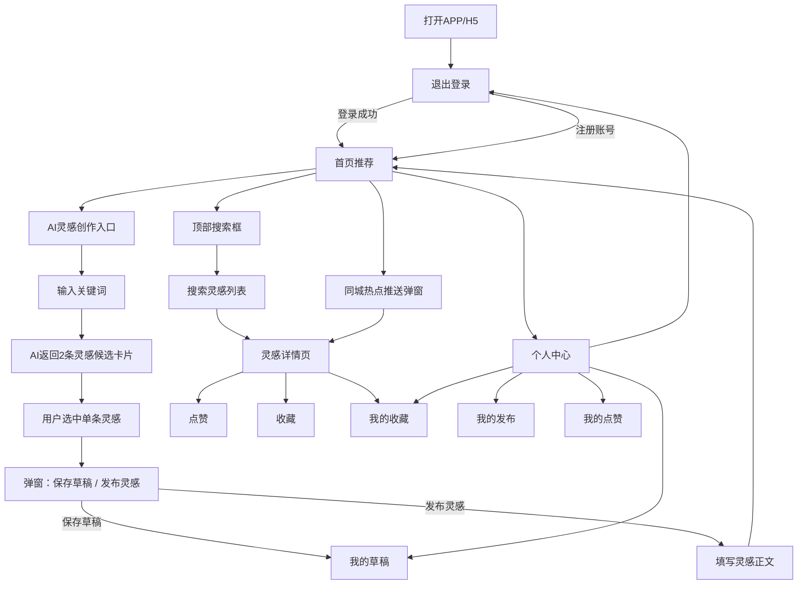
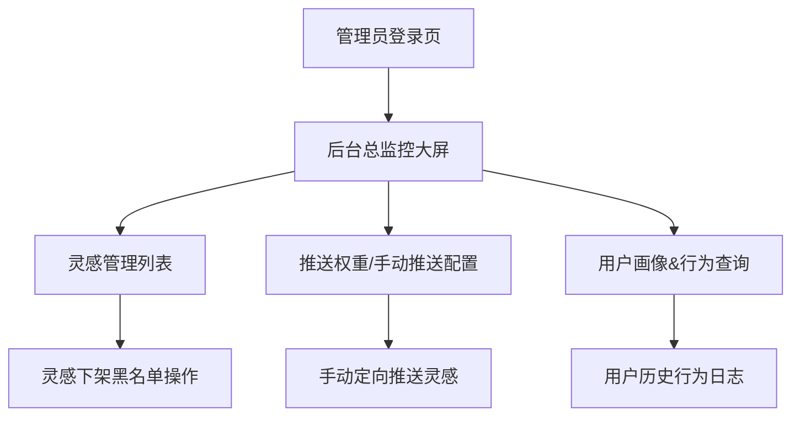

# 一、AI灵感分享平台 PRD 产品需求文档
## 文档基础信息
1. 产品名称：灵思集 AI灵感分享平台
2. 产品定位：用户输入关键词，AI生成创意灵感；基于**地域+时段+用户兴趣**实时个性化推荐，支持UGC灵感广场、管理员运营管控
3. 目标用户：普通C端创意用户；后台运营管理员
4. 技术架构：前文Mermaid架构图整套技术栈
5. 版本：V1.0
6. 编写目的：交付前端、后端、大数据、测试开发落地

## 目录
1. 产品概述
2. 全局通用规则
3. C端用户核心功能模块
4. 管理员后台功能模块
5. 数据埋点与实时计算规则
6. 交互、权限、异常规则
7. 非功能需求（性能/并发/安全）

## 1. 产品概述
### 1.1 核心业务场景
场景1 AI灵感生成
用户输入任意关键词（如鸡腿、短途旅行、居家穿搭），调用Codex AI生成2条差异化灵感标题；用户选中灵感后，可**保存草稿（仅自己可见）/发布到公开灵感广场**；系统自动采集操作时间、地理位置、关键词、选中灵感存入行为流。

场景2 实时个性化推荐
1. 粗推荐：Flink按「城市+时间段+灵感分类」实时聚合热点灵感；
2. 精推荐：基于用户全行为（搜索、浏览、点赞、收藏、发布）计算兴趣权重，首页融合热点+个人偏好加权排序；
3. 同城同时段用户自动推送同类热点灵感消息。

场景3 运营管理后台
管理员实时监控平台数据、手动定向推送灵感、调整推荐权重、灵感黑名单、查看全量用户/行为数据。

### 1.2 角色说明
- C端普通用户：注册登录、AI生成灵感、发布/收藏/点赞、首页推荐、搜索灵感、个人中心
- 运营管理员：登录后台、数据监控、灵感管理、推送配置、用户查询、权重配置

## 2. 全局通用规则
### 2.1 登录鉴权规则
1. 未登录权限限制：仅可浏览广场灵感，**不可使用AI生成、发布、收藏、点赞、接收推送**；
2. 登录凭证：JWT令牌，存入Redis缓存，有效期7天；
3. 密码加密：BCrypt不可逆加密存储MySQL。

### 2.2 定位采集规则
1. 用户打开AI灵感页面时，前端自动获取城市定位上传后端；
2. 定位数据用于同城热点推荐、Flink地域聚合计算。

### 2.3 灵感两种状态
1. 草稿状态：仅存入行为日志，不写入ES检索、不参与热点计算、其他用户不可见；
2. 公开发布状态：写入冷热分离灵感表、同步ES、投递MQ进入实时推荐计算流。

### 2.4 统一返回格式
```json
{
  "code": 200,
  "msg": "操作提示",
  "data": {}
}
code:
200 成功  401未登录  403无权限  500服务异常
```

## 3. C端用户功能模块（完整需求）
### 模块1 注册登录页
1. 注册
输入：用户名、密码、确认密码；
校验：用户名唯一、密码长度6-16位；
成功：写入user表，发送注册MQ事件，自动登录跳转首页。
2. 登录
输入：用户名+密码；校验通过下发JWT。
3. 退出登录：清除本地token、Redis登录缓存。

### 模块2 AI灵感创作页（核心页面）
1. 关键词输入框，输入后点击「AI生成灵感」；
2. 后端调用Codex返回2条灵感标题卡片展示；
3. 用户单选其中一条灵感；
4. 自动上报行为数据：userId、关键词、选中灵感、当前城市、操作时间；
5. 底部弹窗二选一：
- 保存草稿：仅记录行为，不公开；
- 发布灵感：跳转补充灵感详情，发布至广场。
6. 发布补充页：填写完整灵感正文，提交后写入inspire主附表。

### 模块3 首页灵感推荐页
1. 顶部搜索框：关键词搜索灵感，ES检索+用户兴趣二次排序；
2. 推荐信息流：
   数据源1：Flink产出同城分时段热点灵感池；
   数据源2：Redis用户兴趣画像，按分类权重重新排序；
3. 单灵感卡片：封面图、标题、分类、浏览量、点赞按钮、收藏按钮；
4. 点击卡片进入灵感详情；
5. 同城热点推送弹窗：当前时段同城热门灵感主动推送提醒。

### 模块4 灵感详情页
1. 展示完整灵感标题、正文、分类、发布人、发布时间；
2. 互动按钮：点赞、收藏；
3. 互动规则：
   - 点赞/收藏不可重复，Redis+数据库联合唯一校验；
   - 操作行为投递用户行为MQ，更新用户兴趣画像权重。

### 模块5 个人中心
1. 个人基础信息：头像、用户名；
2. 我的发布：所有自己公开的灵感列表；
3. 我的草稿：AI生成未发布灵感；
4. 我的收藏：收藏灵感列表；
5. 我的点赞：点赞记录。

## 4. 管理员后台功能模块
### 模块1 后台登录
管理员账号密码登录，独立权限体系。

### 模块2 实时数据监控大屏
1. 实时指标：在线用户数、今日AI调用次数、灵感发布总量；
2. 分类热度曲线：美食/运动/电影/穿搭/文案实时热度；
3. 城市发布量分布、推送消息队列堆积量；
数据来源：Redis实时缓存、Flink统计指标。

### 模块3 灵感管理
1. 全量灵感列表、按分类/时间筛选；
2. 灵感黑名单操作：下架灵感，不再参与推荐与检索。

### 模块4 推送权重配置
1. 调整推荐融合比例：同城热点权重 / 用户个性化兴趣权重；
2. 手动定向推送：选择灵感、指定城市、指定时段批量推送用户。

### 模块5 用户与行为查询
1. 根据用户ID查询用户兴趣画像（各分类权重）；
2. 查看用户全量历史行为日志。

## 5. 实时计算埋点与权重规则
### 5.1 用户行为全部埋点上报topic_user_behavior
- AI搜索关键词、选中灵感、浏览灵感详情、停留时长、点赞、收藏、发布灵感
### 5.2 兴趣权重计算规则（Flink任务1）
- 发布灵感 +10
- 收藏灵感 +8
- 点赞灵感 +5
- 详情停留>10s +3
- 搜索对应分类关键词 +2
- 仅滑动无互动 +0.2
### 5.3 衰减规则
7天前行为权重衰减30%，保证兴趣时效性
### 5.4 热点聚合规则（Flink任务2）
10分钟滑动窗口，维度：城市+时段+灵感分类，统计发布、互动总量生成热度榜单。

## 6. 异常与交互规则
1. Codex AI调用失败：前端提示「AI服务繁忙，请稍后重试」；
2. 高并发点赞收藏：Redis分布式锁拦截重复请求；
3. ES同步延迟：搜索兜底读取MySQL列表；
4. MQ消息丢失：Flink开启Checkpoint，定时任务兜底补偿。

## 7. 非功能需求
1. 并发：支持万级用户同时在线，热点灵感无数据库行锁竞争；
2. 检索：关键词搜索响应<200ms；
3. 实时性：新灵感发布后5分钟内进入同城热点推荐池；
4. 存储：支持百万级灵感、千万级行为日志冷热分离存储；
5. 安全：接口限流防刷、SQL防注入、敏感信息脱敏。

---

# 二、页面原型图 Mermaid 页面流程图（ProcessOn可直接导入）
## 1、C端用户页面跳转原型流程图


## 2、管理员后台页面原型流程图


## 三、原型页面文字结构（可直接复制进ProcessOn画框）
### C端页面清单
1. 登录注册页
   - 用户名输入框、密码输入框、注册切换tab、登录按钮
2. 首页推荐页
   - 顶部搜索框、信息流灵感卡片、推送弹窗
3. AI灵感创作页
   - 关键词输入框、AI生成按钮、双灵感候选卡片、底部操作弹窗
4. 灵感发布编辑页
   - 灵感正文富文本输入、发布提交按钮
5. 灵感详情页
   - 标题、正文、分类、点赞/收藏按钮
6. 个人中心主页
   - 头像、用户名、四大功能入口：我的发布、草稿、收藏、点赞

### 管理员后台页面清单
1. 后台登录页
2. 实时数据监控大屏（图表、数字指标）
3. 灵感管理列表页（筛选、下架操作）
4. 推送配置页（权重滑块、手动推送表单）
5. 用户查询页（用户ID输入框、画像展示、行为日志列表）