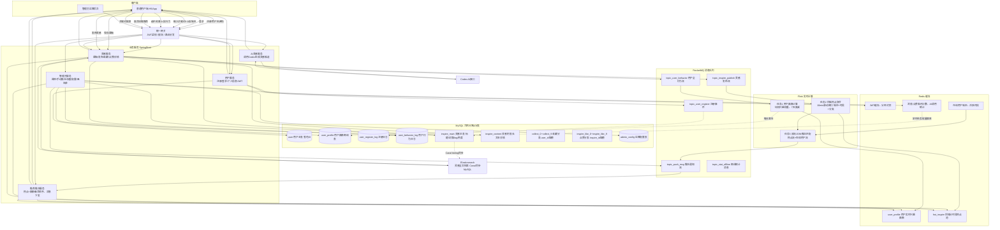

# AI灵感分享平台 架构评审报告
文档版本：V1.0
评审时间：2026-06-26
评审参与：后端开发、大数据开发、运维、产品、测试
评审对象：整套业务架构、Mermaid架构流程图、中间件部署方案
## 一、评审基础信息
1. 项目名称：灵思集 AI灵感分享平台
2. 核心业务：AI关键词生成灵感、草稿/公开发布、同城时段热点、用户个性化画像推荐、管理员运营管控
3. 技术栈：SpringBoot3 + MySQL8.0 + Redis6 + RocketMQ4.9 + Elasticsearch8 + Flink1.17 + Codex AI + JWT + 雪花ID
4. 架构核心设计：冷热分离灵感表、点赞/收藏分表、Flink实时流式计算、Canal同步ES、MQ异步解耦削峰
5. 交付物：Mermaid架构图、中间件集群部署方案、全套MySQL建表SQL、PRD、开发排期表

# 二、附件1：评审用完整Mermaid架构图代码

# 三、附件2：中间件集群部署方案
## 3.1 MySQL 部署方案（读写分离）
1. 架构：1主2从
   - Master：写入操作（用户注册、灵感发布、收藏点赞）
   - Slave1：分页列表、详情查询、后台报表
   - Slave2：Canal binlog同步数据源、离线统计查询
2. 分表规则：
   - collect_0~9：user_id % 10
   - inspire_like_0~9：inspire_id % 10
3. 存储优化：冷热分离两张灵感表，TEXT字段独立附表
4. 备份：每日凌晨全量备份 + binlog增量备份，保留7天日志
5. 隔离：业务库与日志库分实例部署，行为日志大表不占用业务库资源

## 3.2 Redis 部署方案（主从+哨兵集群，3主3从）
1. 分片拆分：
   - 分片1：JWT登录、分布式锁
   - 分片2：用户画像、在线用户位置缓存
   - 分片3：热点灵感池、浏览/点赞计数缓存
2. 过期策略：
   - JWT 7天过期；用户画像永不过期；在线用户30分钟过期
3. 持久化：RDB定时快照 + AOF增量持久化，防止缓存雪崩丢失计数
4. 防护：开启限流、禁用大key、热点key本地缓存降级

## 3.3 RocketMQ 部署方案（4节点Broker集群，NameServer 3节点）
1. Topic划分5个业务隔离主题，互不影响：
   topic_user_register / topic_user_behavior / topic_inspire_publish / topic_push_msg / topic_stat_offline
2. 消息可靠性：
   - 生产者同步发送、事务消息保障入库与发消息原子性
   - 消费者手动ACK，失败重试3次，超过重试进入死信队列
3. 堆积监控：堆积阈值10万告警，避免Flink消费阻塞
4. 消息清理：保留3天消息，自动清理过期数据

## 3.4 Elasticsearch + Canal 部署
1. ES集群：3节点分片，分片数3，副本1；仅同步公开灵感主表数据
2. Canal独立部署，监听MySQL Master binlog，增量同步ES
3. Mapping设计：title/content分词检索，tag/heat用于筛选排序
4. 同步兜底：每日凌晨全量同步一次，修复增量同步缺失数据

## 3.5 Flink 流式计算集群（1JobManager + 4TaskManager）
1. 3个独立任务隔离部署，互不抢占资源：画像计算、热点聚合、双流推送匹配
2. Checkpoint配置：5分钟一次，持久化至HDFS，故障自动恢复状态
3. 水印延迟：2分钟水印，解决网络延迟行为数据乱序问题
4. 资源隔离：画像任务分配更多内存，热点聚合分配更多CPU

## 3.6 网关&业务服务部署
1. 网关独立集群（2实例）：统一限流、鉴权、路由，剥离业务逻辑
2. 微服务多实例水平扩容：用户服务、AI服务、灵感服务、推荐服务、管理服务各2实例
3. AI调用单独服务隔离，防止大模型超时拖垮核心业务

# 四、架构评审核心结论
## 4.1 架构优势（评审通过点）
1. **分层清晰**：客户端→网关→业务服务→MQ→Flink计算→缓存/存储，职责单一，易迭代维护
2. **高并发设计到位**
   - 点赞、收藏分表，避免单表千万数据锁竞争
   - 浏览、点赞计数Redis缓冲，异步批量落库，消除热点行UPDATE
   - MQ削峰，AI生成、灵感发布高峰不压垮数据库
3. **实时推荐能力完整**
   Flink滑动窗口聚合同城时段热点 + 用户加权画像，实现千人千面个性化推荐，满足产品核心场景
4. **数据分层隔离**
   冷热分离灵感表、行为日志独立大表、离线画像落地表，查询性能、存储成本平衡
5. **可扩展预留**
   雪花ID适配未来分库分表、ext_json扩展字段无需DDL改表、中间件全集群支持水平扩容
6. **数据一致性兜底机制**
   Canal同步ES、Flink Checkpoint、定时任务批量同步计数、每日全量数据校准，多重兜底防止数据不一致
7. **权限分层管控**
   网关统一JWT鉴权，未登录隔离核心操作；管理员后台独立权限体系

## 4.2 架构缺陷 & 风险点记录（重点整改项）
### 风险1：Codex AI第三方接口依赖（高风险）
- 风险描述：AI灵感生成强依赖外部Codex接口，若第三方超时、限流、宕机，核心创作功能完全不可用；无本地降级方案。
- 影响范围：C端核心AI创作场景全失效，用户流失
- 整改方案：
  1. 本地缓存高频关键词AI返回结果，减少重复调用第三方；
  2. 配置超时熔断降级，AI不可用时提示缓存历史灵感；
  3. 增加备用AI接口渠道，双接口故障切换；
  4. 网关层限制单用户AI调用QPS，防止刷接口产生高额费用。

### 风险2：Flink集群故障，实时推荐数据停滞（中高风险）
- 风险描述：Flink任务崩溃后，热点池、用户画像停止更新，首页推荐变为旧数据，推荐实时性失效；虽然有Checkpoint恢复，但恢复存在5~10分钟空档期。
- 整改方案：
  1. 配置Flink任务自动重启告警，监控任务失败即时通知运维；
  2. 增加定时离线计算任务兜底，每15分钟批量刷新Redis热点池；
  3. 拆分三大Flink任务独立资源，单一任务崩溃不影响另外两个计算任务。

### 风险3：Redis缓存雪崩/缓存击穿（中风险）
- 风险描述：热点灵感、热门用户画像大量过期，瞬间大量请求穿透MySQL，压垮数据库；大key存储海量行为标签导致Redis阻塞。
- 整改方案：
  1. 热点key过期时间随机打散，避免同一时间批量过期；
  2. 热点灵感添加互斥分布式锁，防止缓存击穿；
  3. 用户画像、热点池拆分小key存储，避免单key过大；
  4. 开启Redis监控，大key实时告警。

### 风险4：RocketMQ消息堆积未做限流（中风险）
- 风险描述：AI高峰、灵感批量发布时，行为流topic大量消息堆积，Flink消费速度跟不上，内存溢出任务崩溃。
- 整改方案：
  1. 生产者侧设置消息发送限流；
  2. Flink消费端批量消费，提升吞吐量；
  3. 堆积超过阈值触发告警，临时扩容TaskManager。

### 风险5：分表无自动路由中间件（中等风险）
- 风险描述：当前仅提供SQL分表模板，业务代码手动取模路由分表，新增/减少分表数量需要全量修改代码，扩展性差。
- 整改方案：接入Sharding-JDBC分表中间件，统一配置路由规则，无需硬编码计算取模。

### 风险6：行为日志表无冷热数据清理策略（低风险）
- 风险描述：user_behavior_log永久写入不清理，长期运行表容量持续膨胀，查询变慢，磁盘占用过高。
- 整改方案：按月份分区表，超过6个月的历史行为日志归档至离线存储，在线库只保留近6个月数据。

### 风险7：ES同步延迟无监控（低风险）
- 风险描述：Canal同步中断无告警，ES搜索数据与MySQL不一致，用户搜索结果缺失新发布灵感。
- 整改方案：新增定时校验脚本，对比MySQL与ES灵感总量、ID差异，不一致触发告警。

### 风险8：无全链路压测预案（低风险）
- 风险描述：未验证万级并发场景下中间件、数据库承载能力，上线后大流量可能出现未知性能瓶颈。
- 整改方案：上线前执行全链路压测，模拟AI生成、灵感发布、首页推荐高峰流量，记录性能阈值。

# 五、架构优化落地排期
| 风险等级 | 优化内容 | 负责角色 | 完成节点 |
| ---- | ---- | ---- | ---- |
| 高风险 | Codex AI熔断、缓存、双接口降级方案 | 后端 | 基础服务开发阶段 |
| 中高风险 | Flink任务告警、定时兜底离线计算 | 大数据 | Flink开发阶段 |
| 中风险 | Redis缓存雪崩/击穿防护、大key治理 | 后端+运维 | 缓存封装开发 |
| 中风险 | RocketMQ堆积监控、消费批量优化 | 后端+大数据 | MQ开发阶段 |
| 中等风险 | Sharding-JDBC分表中间件接入 | 后端 | 数据库开发初期 |
| 低风险 | 行为日志按月分区归档清理 | 运维+后端 | 上线前完成 |
| 低风险 | MySQL与ES数据一致性校验脚本 | 大数据 | ES开发阶段 |
| 低风险 | 全链路压测方案执行 | 测试+运维 | 联调完成后上线前 |

# 六、评审最终结论
1. 整体架构可满足业务V1.0版本上线需求，核心流程、高并发、实时推荐设计合理；
2. 所有风险点全部记录，按风险等级分阶段整改，高风险项必须在开发前期完成改造；
3. 整改全部落地后，架构评审通过，可按照开发排期启动编码工作；
4. 版本迭代新增业务功能时，需二次评审中间件、存储扩容方案。